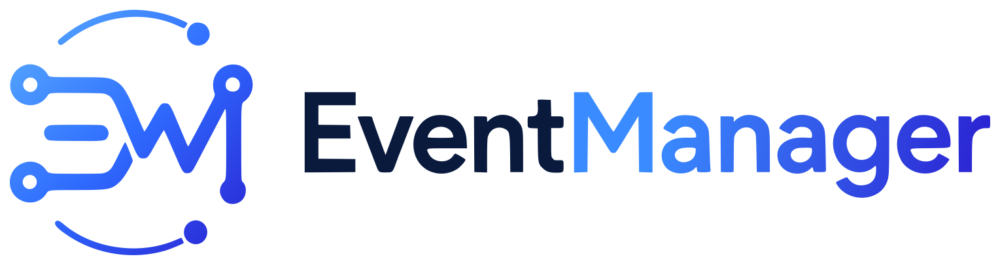

<div align="center">
  <p>
    
  </p>
  <p>
    <a href="https://www.npmjs.com/package/@webeach/event-manager">
      
    </a>
    <a href="https://github.com/webeach/event-manager/actions">
      
    </a>
    <a href="https://www.npmjs.com/package/@webeach/event-manager">
      
    </a>
    <a href="https://github.com/webeach/event-manager/blob/main/LICENSE">
      
    </a>
    <a href="https://bundlephobia.com/package/@webeach/event-manager">
      
    </a>
  </p>
  <p><a href="./README.md">🇺🇸 English</a> | <a href="./README.ru.md">🇷🇺 Русский</a></p>
  <p>Лёгкая библиотека для упрощённой работы с событиями в JavaScript и TypeScript.</p>
</div>

---

## 💎 Возможности

- Компактное и понятное управление обработчиками событий
- Работа с несколькими событиями одновременно
- Полная поддержка TypeScript с автоматическим выводом типов событий
- Работает с `window`, DOM-элементами и собственными шинами событий
- Нет зависимостей в рантайме

---

## 💡 Проблема

Работа с нативными браузерными событиями имеет несколько неудобных моментов, которые быстро накапливаются.

**Чтобы удалить обработчик, нужна точная ссылка на функцию.** Анонимную функцию, переданную в `addEventListener`, невозможно удалить — каждую функцию-обработчик приходится заранее сохранять в переменную:

```js
// ❌ Это не работает — каждый раз создаётся новый объект функции
element.addEventListener('click', () => doSomething());
element.removeEventListener('click', () => doSomething());

// ✅ Работает только так
function handleClick() {
  doSomething();
}
element.addEventListener('click', handleClick);
element.removeEventListener('click', handleClick);
```

**С несколькими событиями это превращается в много шаблонного кода.** Нужно отдельно хранить каждую ссылку, повторять элемент на каждой строке, а затем зеркально воспроизвести те же вызовы для удаления:

```js
const handleClick = () => {
  /* ... */
};
const handleFocus = () => {
  /* ... */
};
const handleKeydown = () => {
  /* ... */
};

button.addEventListener('click', handleClick);
button.addEventListener('focus', handleFocus);
button.addEventListener('keydown', handleKeydown);

// Позже, для очистки...
button.removeEventListener('click', handleClick);
button.removeEventListener('focus', handleFocus);
button.removeEventListener('keydown', handleKeydown);
```

**Параметры должны совпадать точно.** Если обработчик зарегистрирован с `{ capture: true }`, тот же параметр нужно передать в `removeEventListener` — если забыть, обработчик молча останется привязанным.

**`event-manager` решает эту проблему.** Библиотека отслеживает все зарегистрированные обработчики внутри себя, поэтому хранить ссылки самостоятельно не нужно. Удалите одно событие, несколько или все сразу — в один вызов:

```js
const listener = listen(button, {
  click: () => {
    /* ... */
  },
  focus: () => {
    /* ... */
  },
  keydown: () => {
    /* ... */
  },
});

// Удалить всё — без ссылок, без повторений
listener.remove();
```

---

## 📦 Установка

```bash
npm install @webeach/event-manager
```

```bash
pnpm add @webeach/event-manager
```

```bash
yarn add @webeach/event-manager
```

### Подключение в браузере через CDN

Без сборки — подключайте напрямую через [unpkg](https://unpkg.com) или [jsDelivr](https://www.jsdelivr.com):

```html
<script type="module">
  import { listen } from 'https://unpkg.com/@webeach/event-manager';

  listen(document.getElementById('my-button')).add('click', () =>
    console.log('clicked!'),
  );
</script>
```

---

## 🚀 Быстрый старт

### Подписка на глобальные события `window`

```js
import { listen } from '@webeach/event-manager';

listen(window)
  .add('resize', () => console.log('Размер окна изменён!'))
  .add('scroll', () => console.log('Окно прокручено!'));
```

### Подписка на события DOM-элемента

```js
import { listen } from '@webeach/event-manager';

const myButton = document.getElementById('my-button');

listen(myButton)
  .add('click', () => console.log('Клик по кнопке!'))
  .add('focus', () => console.log('Фокус на кнопке!'));
```

### Подписка и удаление событий

```js
import { listen } from '@webeach/event-manager';

const myButton = document.getElementById('my-button');

const myButtonListener = listen(myButton).add('click', () =>
  console.log('Клик по кнопке!'),
);

// Отписываемся от события через 10 секунд
window.setTimeout(() => {
  myButtonListener.remove('click');
}, 10000);
```

### Собственная шина событий

```js
import { listen } from '@webeach/event-manager';

const myListener = listen();

myListener
  .add('test', () => console.log('Событие "test" вызвано'))
  .add('hello', (event) => console.log(`Привет, ${event.detail.name}!`));

window.setTimeout(() => {
  myListener.trigger('test');
  myListener.trigger('hello', { name: 'Александр' });
}, 3000);
```

### Отписка от всех событий

```js
import { listen } from '@webeach/event-manager';

const windowListener = listen(window);

windowListener
  .add('focus', () => console.log('Событие "focus" вызвано'))
  .add('resize', () => console.log('Событие "resize" вызвано'))
  .add('scroll', () => console.log('Событие "scroll" вызвано'));

window.setTimeout(() => {
  windowListener.remove();
  // или: windowListener.remove(['focus', 'resize', 'scroll']);
}, 3000);
```

### Несколько обработчиков

```js
import { listen } from '@webeach/event-manager';

const myButton = document.getElementById('my-button');
const myButtonListener = listen(myButton);

// Оба обработчика сработают
myButtonListener.add('click', () => console.log('Обработчик A'));
myButtonListener.add('click', () => console.log('Обработчик B'));

// Передача массива обработчиков
myButtonListener.add('focus', [
  () => console.log('Обработчик фокуса A'),
  () => console.log('Обработчик фокуса B'),
]);
```

---

## 🛠️ API

### `listen(target?, handlers?)`

Создаёт `EventManager` для указанного target. Передайте `null` или ничего, чтобы создать собственную шину событий.

```ts
listen(window);
listen(element, { click: handler });
listen(); // собственная шина событий
```

### `add(type, handler | handler[], options?)`

Добавляет один или несколько обработчиков события.

| Параметр  | Тип                      | Описание                                               |
| --------- | ------------------------ | ------------------------------------------------------ |
| `type`    | `string`                 | Имя типа события, например `"click"`                   |
| `handler` | `function \| function[]` | Функция-обработчик или массив функций                  |
| `options` | `object`                 | Необязательно: `{ capture?: boolean, once?: boolean }` |

### `capture(type, handler | handler[])`

Сокращение для `add(type, handler, { capture: true })`.

### `once(type, handler | handler[])`

Сокращение для `add(type, handler, { once: true })`.

### `remove(type | type[])`

Удаляет обработчики для указанных типов событий. Затрагивает только обработчики, зарегистрированные через этот экземпляр.

| Параметр | Тип                  | Описание                                  |
| -------- | -------------------- | ----------------------------------------- |
| `type`   | `string \| string[]` | Тип события или массив типов для удаления |

### `remove()`

Удаляет все обработчики, зарегистрированные через этот экземпляр.

### `trigger(type, detail?)`

Генерирует `CustomEvent` с указанным типом и необязательным объектом detail.

| Параметр | Тип      | Описание                             |
| -------- | -------- | ------------------------------------ |
| `type`   | `string` | Тип события для отправки             |
| `detail` | `any`    | Необязательный объект `event.detail` |

### `trigger(event)`

Отправляет существующий объект `Event` напрямую.

| Параметр | Тип     | Описание                     |
| -------- | ------- | ---------------------------- |
| `event`  | `Event` | Экземпляр Event для отправки |

---

## 🧩 TypeScript

Библиотека полностью типизирована и автоматически выводит типы событий на основе наблюдаемого объекта.

```ts
import { listen } from '@webeach/event-manager';

// События window — полностью типизированы
const windowListener = listen(window);
windowListener.add('resize', (event) => {
  // event имеет тип UIEvent
});

// Определение собственных типов событий
interface MyEvents {
  hello: CustomEvent<{ name: string }>;
  ping: CustomEvent;
}

const bus = listen<EventTarget, MyEvents>();

bus.add('hello', (event) => {
  console.log(`Привет, ${event.detail.name}!`);
});

bus.trigger('hello', { name: 'Александр' });
```

---

## 📖 Реальные примеры

### Изменение текста по hover

```ts
import { listen } from '@webeach/event-manager';

const basketButton = document.querySelector(
  '.basket-button',
) as HTMLButtonElement;

listen(basketButton, {
  mouseenter: () => {
    basketButton.textContent = 'Перейти в корзину';
  },
  mouseleave: () => {
    basketButton.textContent = 'Корзина покупок';
  },
});
```

### Отслеживание кликов по ссылкам

```ts
import { listen } from '@webeach/event-manager';

listen(document).add('click', ({ target }) => {
  const anchor = (target as Element).closest('a') as HTMLAnchorElement | null;

  if (
    anchor !== null &&
    anchor.href !== '' &&
    (anchor.hostname !== window.location.hostname ||
      anchor.pathname !== window.location.pathname ||
      anchor.search !== window.location.search)
  ) {
    navigator.sendBeacon('/track', JSON.stringify({ link: anchor.href }));
  }
});
```

### Работа с `postMessage`

```ts
import { listen } from '@webeach/event-manager';

const banner = document.getElementById('banner') as HTMLIFrameElement;

listen(window).add('message', (event) => {
  const { type, height } = event.data || {};

  if (type === 'setHeight' && typeof height === 'number') {
    banner.style.height = `${height}px`;
  }
});
```

### Отслеживание прокрутки в React

```tsx
import { FC, PropsWithChildren, useEffect, useState } from 'react';
import { listen } from '@webeach/event-manager';

const SHOW_TOP_BUTTON_SCROLL_OFFSET = 120;

export const PageLayout: FC<PropsWithChildren> = ({ children }) => {
  const [topButtonShown, setTopButtonShown] = useState(false);

  useEffect(() => {
    const { remove } = listen(window, {
      scroll: () => {
        setTopButtonShown(window.scrollY >= SHOW_TOP_BUTTON_SCROLL_OFFSET);
      },
    });

    return () => {
      remove();
    };
  }, []);

  return (
    <div className="page-layout">
      <main className="page-layout__content">{children}</main>
      {topButtonShown && (
        <button
          aria-label="Прокрутить вверх"
          className="page-layout__top-button"
          onClick={() => window.scrollTo(0, 0)}
        />
      )}
    </div>
  );
};
```

---

## 👨‍💻 Автор

Разработка и поддержка: [Ruslan Martynov](https://github.com/ruslan-mart)

Если у вас есть предложения или вы нашли баг — смело открывайте issue или присылайте pull request.

---

## 📄 Лицензия

Этот пакет распространяется под лицензией [MIT](./LICENSE).
